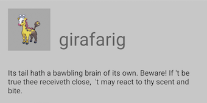

# Pokemon Search SDK

Library to allow to easily show details about pokemons.

# Main features

All of the interesting API you will find in the **com.example.pokemon.model.Pokemons** class. You can do the followning:

- get all available sprites for given pokemon name
- get shakespearen translation of the description for given pokemon name
- get combined pokemon details including shakespearen (as PokemonViewModel) for given pokemon name. This api for demonstration purpouses exists in two versions: standard suspended function and coroutine flow.
- add, remove pokemon to a favourites list
- fetch all favourite pokemons
- translate any text into its shakespearen version

The UI elements to embedd to your application are here: **com.example.pokemon.ui**

- PokemonDetailsConstraintLayout
- PokemonViewModel

## Project structure

    root\
        |
        |\
        | app - example application 
        \
          pokemon - Pokemon search module
          
## How to integrate

Add the pokemon library to your project as a module

*In your settings.gradle*

    include ':pokemon'

*In your build.gradle (app)* replace the ':pokemon' with path releative to your main project

    implementation project(path: ':pokemon')

In you Application class you need to initialize pokemon classes like this:

    import android.app.Application  
    import com.example.pokemon.model.Configuration  
    import com.example.pokemon.storage.Storage  
    import okhttp3.logging.HttpLoggingInterceptor  
      
    class PokemonSearchApplication : Application() {  
        override fun onCreate() {  
            super.onCreate()  
            Storage.initializeStorage(this)  
            Configuration.httpLoggingLevel = HttpLoggingInterceptor.Level.BASIC  
      }  
    }

By making changes to Configuration properties you will be able to point SDK to different endpoints. This could be helpful it you would like to use mocked responses. **Like below. Just remember the following cannot be done on the Main thread.**

    Configuration.pokemonApiEndpoint = mockWebServer?.url("pokemon/").toString()  
    Configuration.shakespeareTranslationApiEndpoint =  
        mockWebServer?.url("shakespeare/").toString()

## External libraries used

Following libraries are used in this project:

    implementation "com.squareup.retrofit2:retrofit:(version)"  
    implementation "com.squareup.retrofit2:converter-gson:(version)"  
    implementation 'com.google.code.gson:gson:2.8.6'  
    implementation "com.squareup.okhttp3:logging-interceptor:(version)"  
    testImplementation "com.squareup.okhttp3:mockwebserver:(version)"

## Test application

This repository is the  test application that contains the module. Application does have 2 tabs: Favourites and Search. 

In the search tab you can search a pokemon by name. As you start typing some propositions will appear. You can choose from the list or continiue typing on your own. You are not limitted to the proposition list. Once found you will be able to add it to your favourites.

In the Favourites tab you will find all your pokemons that you've added to favourites on the search tab.
By long pressing on a pokemon you will be able to remove it from the list.

## Future improvements required for the test application

The application is currently very basic. User interaction, flows and error messeging in the application should be improved to make it more user frendly.

## Future improvement for the SDK

- Caching of the responses to improve response speed.
- More sophisticated dependency injection
- Checking if pokemon with certain ID is already in your favourites.
- Unifi datatypes so that only the one type exposed from the SDK
